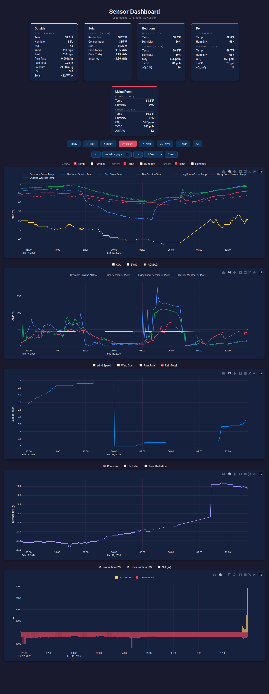

# GutHome

A local home monitoring dashboard that collects and displays data from multiple sensor sources on a single web interface.



## Features

- **Sensibo** - Temperature, humidity, CO2, TVOC, and IAQ from Sensibo IR remotes (via REST API)
- **Govee H5074** - Temperature and humidity from Govee BLE sensors (via Bluetooth LE scanning)
- **Weather Underground** - Outdoor temperature, humidity, wind, rain, pressure, UV, and solar radiation from a personal weather station
- **Air Quality** - Outdoor AQI, PM2.5, and PM10 from Open-Meteo (no API key required)
- **Enphase Solar** - Production, consumption, and net power from a local Enphase IQ Gateway

### Dashboard

- Interactive Plotly.js charts with per-metric checkboxes
- Current value cards grouped by room/source
- Date picker with day/week/month/year navigation and a Today button
- Time range presets (1 hour, 6 hours, 24 hours, 7 days, 30 days, 1 year, all)
- Cards show latest values for live views, averages for historical ranges
- All timestamps displayed in Pacific time
- Auto-refreshes every 60 seconds
- Dark theme

## Requirements

- Python 3.10+
- Bluetooth adapter (for Govee BLE scanning)

### Python packages

```
flask
requests
bleak
```

## Setup

1. Clone the repository:
   ```bash
   git clone git@github.com:mguthaus/GutHome.git
   cd GutHome
   ```

2. Install dependencies:
   ```bash
   pip install flask requests bleak
   ```

3. Copy the example config and fill in your values:
   ```bash
   cp config.py.example config.py
   ```

   Edit `config.py` with:
   - **Sensibo API key** - Get one at https://home.sensibo.com/me/api
   - **Weather Underground station ID** - Your PWS station ID
   - **Enphase gateway IP and JWT token** - Get a token at `https://enlighten.enphaseenergy.com/entrez-auth-token?serial_num=YOUR_SERIAL`
   - **Govee device MAC addresses** - Mapped to room names

4. Run the server:
   ```bash
   python server.py
   ```

   The dashboard will be available at `http://<your-ip>:8080`

## Running as a systemd service

```bash
sudo cp sensibo-dashboard.service /etc/systemd/system/
sudo systemctl daemon-reload
sudo systemctl enable sensibo-dashboard.service
sudo systemctl start sensibo-dashboard.service
```

Edit the service file to match your Python path and working directory.

## Data Storage

All sensor data is stored in a local SQLite database (`sensibo_data.db`) with separate tables for each source:
- `readings` - Sensibo data
- `govee_readings` - Govee BLE data
- `weather_readings` - Weather station and AQI data
- `solar_readings` - Enphase solar data

## Poll Intervals

Configured in `config.py`:
- Sensibo: 5 minutes
- Weather Underground: 5 minutes
- Enphase Solar: 5 minutes
- Govee BLE: 30 minutes (60-second scan window)
